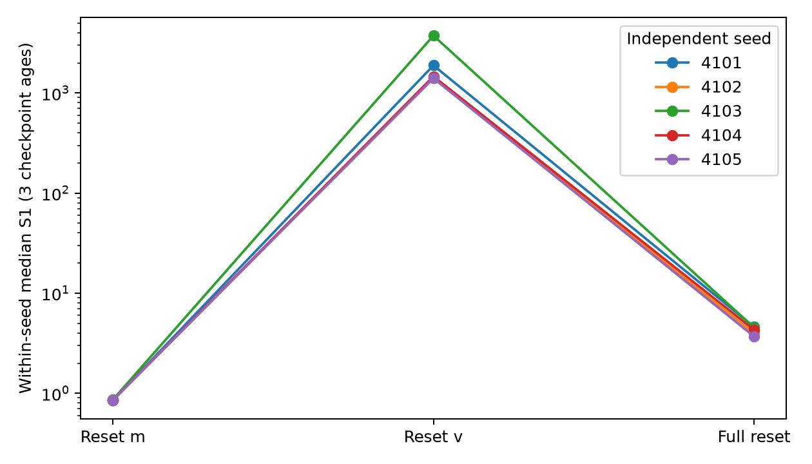
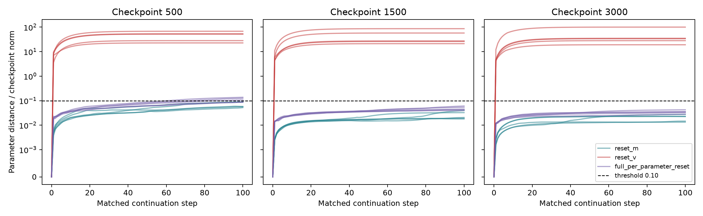
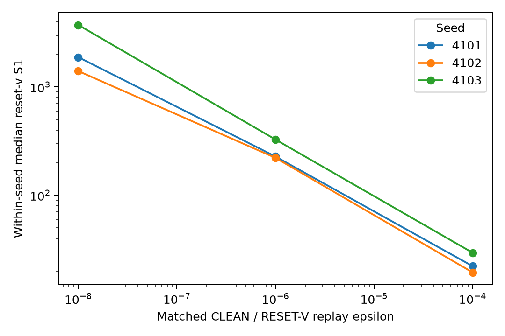

# CNN / CIFAR-10 cross-architecture replication

**REPLICATION SUPPORTED**

## Frozen protocol

Protocol SHA256: 5b0213c94acc2bf1a7ce1444f0a8c2598385ca2613f96b97d19de162d412094c

Five independent seeds 4101–4105; checkpoints 500, 1500, 3000; H=100. CNN: five 3x3 padded convolutions with channels 3→32→32→64→64→128, ReLU after each, 2x2 max pooling after conv2 and conv4, global average pooling, Linear(128,10). Exactly 140714 parameters. No BatchNorm/dropout/augmentation.
Official CIFAR-10: 50000 train / 10000 test. CPU ToTensor-equivalent conversion and normalization mean (0.4914,0.4822,0.4465), std (0.2470,0.2435,0.2616). Batch 128; seeded per-epoch shuffle; incomplete last batch dropped. Saved plans pair all continuations.
AdamW: LR 0.001; betas (0.9,0.999); epsilon 1e-8; weight decay 0.01; float32; foreach/fused/AMSGrad disabled. No scheduler or clipping. Cross entropy. Deterministic algorithms and cuDNN; TF32 disabled.
Reset-m clears only m; reset-v clears only v; full reset clears all per-parameter optimizer state including age. Model parameters and optimizer groups remain identical. Primary S1 = ||candidate update − clean update|| / (||clean update|| + 1e-12); absolute update norms and cosine retained. Tau = 0.10 ||checkpoint parameters||; first distance ≥ tau counted, noncrossings censored at 100.
Full test evaluation at continuation steps 0,1,25,50,75,100. Checkpoint ages are repeated measures. Primary aggregate is the median across five within-seed medians, with min/max/IQR and paired seed counts; no p-values.

## Results

| Seed | Reset m median S1 | Reset v median S1 | Full reset median S1 |
|---|---:|---:|---:|
| 4101 | 0.847788 | 1887.26 | 4.59862 |
| 4102 | 0.848148 | 1403.96 | 3.97537 |
| 4103 | 0.861285 | 3743.08 | 4.53782 |
| 4104 | 0.853805 | 1466.46 | 4.30161 |
| 4105 | 0.854909 | 1405.59 | 3.69602 |

| Family | Median seed-median S1 | Min–max | IQR | Crossing rows | H100 accuracy | H100 loss |
|---|---:|---:|---:|---:|---:|---:|
| clean | 0 | 0–0 | 0 | 0/15 | 63.06% | 1.03591 |
| reset_m | 0.853805 | 0.847788–0.861285 | 0.00676069 | 0/15 | 62.68% | 1.03791 |
| reset_v | 1466.46 | 1403.96–3743.08 | 481.671 | 15/15 | 19.60% | 2.13139 |
| full_per_parameter_reset | 4.30161 | 3.69602–4.59862 | 0.562445 | 3/15 | 63.18% | 1.0189 |

H100 loss/accuracy use the median of within-seed checkpoint medians. Full time series remain in functional_rows.csv. Crossing rows are descriptive repeated-measure counts, not independent replicates.

- full_per_parameter_reset_gt_reset_m: 5/5 seeds
- reset_v_gt_full_per_parameter_reset: 5/5 seeds
- reset_v_gt_reset_m: 5/5 seeds
- H3 favorable: 5/5; adverse: 0/5.

Absolute update norms and cosines are mandatory raw fields in first_step_rows.csv, with within-seed norm medians in seed_summary.csv.

## Supporting epsilon check

Three fixed seeds, all three ages, one matched step per epsilon. Both CLEAN and RESET-V use the same replay epsilon. Baseline epsilon=1e-8 reproduces the primary result exactly.

| Epsilon | Median seed-median reset-v S1 |
|---:|---:|
| 1e-08 | 1887.26 |
| 1e-06 | 228.009 |
| 1e-04 | 22.1265 |

## Compute, validation and limitations

Primary runtime 718.67 seconds; corrected source-only pilot 14.66 seconds; optional epsilon runtime 6.44 seconds.
NVIDIA GeForce GTX 1650; Python 3.14.4, PyTorch 2.11.0+cu128, torchvision 0.26.0+cu128, CUDA 12.8. All 5 seeds and 15 checkpoints succeeded.
Nine focused tests passed; independent postcollection audit passed, including exact first-step metric reproduction. See validation_report.md for existing verifier results and the preserved preflight failure.
The pilot used the first 2000 official test images to check basic learning. These are included in the later full test evaluations, so functional test performance is supporting evidence rather than an untouched model-selection benchmark. The primary optimizer/trajectory metrics do not use labels from that held-out split.
This is one small CNN, one image dataset, one fixed training recipe, five seeds and three repeated checkpoint ages. It is evidence about this substrate, not a universal claim across architectures. No inferential p-values or independent-replicate claims for checkpoint rows are made.
For an IRIS submission this provides an auditable, prospectively frozen extension with a meaningfully different architecture/task. It is suitable to add with its actual verdict and limitations; it does not justify a broader claim than the measured ordering and divergence. Admission or judging outcomes are not assessed.

## Provenance and files

Branch: experiment/cnn-cross-architecture-replication; source commit: aa81e700ca4fcb1913fe399d4dd543d15993297b. Working tree was already dirty; preexisting work was preserved. New implementation lives entirely in this directory and is identified by frozen SHA256 hashes. No commits or paper edits were made.
protocol.json/.md/.sha256 contain the exact design; environment.json records software and dataset hashes; checkpoints/ retains source states and future batch plans; checkpoint_manifest.json links every case to source SHA256; CSV files hold source, first-step, trajectory, functional and seed-level records; aggregate_summary.json holds the seed-aware analysis; test and audit reports retain validation evidence.
Reproduction entry points: run_experiment.py pilot; study.py freeze; test_experiment.py; study.py primary; study.py epsilon; audit_results.py. Existing output names are protected against overwrites. For a new run use a new explicitly named result directory and freeze its protocol before comparisons.
Precollection failure: v1 GPU conversion failed exact CPU reference preprocessing equality. v1 was retained without primary outcomes; v2 corrected preprocessing and reran the source-only pilot and unchanged tests before primary collection. See precollection_deviations.json. Neither protocol was edited after primary outcomes.

REPLICATION SUPPORTED
